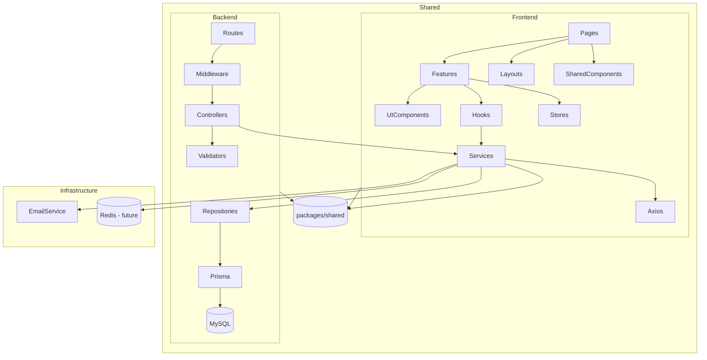

# Dependency Rules

**Last updated:** 2026-07-04

## Layer Dependency Rules

The system follows strict dependency rules. Violations must be caught in code review and, where possible, via automated linting.

### Golden Rule

**Dependencies point inward. Outer layers depend on inner layers. Inner layers never depend on outer layers.**

```
Controller  →  Service  →  Repository  →  Prisma  →  MySQL
    │              │              │
    ▼              ▼              ▼
  DTOs          Types          Interfaces
```

---

## Backend Layer Rules

### Allowed Dependencies

| Layer | Can Depend On | Cannot Depend On |
|-------|---------------|------------------|
| **Controller** | Service (interface), Validator, DTOs, Types | Repository, Prisma, External APIs, HTTP internals |
| **Validator** | Zod (only) | Any application code |
| **Service** | Repository (interface), Types, Interfaces, `common/`, other Service (interface) | Controller, HTTP, Express, Prisma directly |
| **Repository** | Prisma client (`lib/prisma`), Types, Interfaces | Controller, Service, HTTP |
| **DTO** | Types | Any layer |
| **Types** | Nothing (pure types) | Any layer |
| **Middleware** | Services, Validators, Types, Config | Repositories directly |
| **Config** | Environment variables, Zod | Any application code |
| **Common** | Types, Config | Any module-specific code |

### Module Dependency Rules

| Rule | Description |
|------|-------------|
| **Module A → Module B** | Only through Module B's `index.ts` (which exports Service interface and routes) |
| **No circular dependencies** | If Module A depends on Module B and Module B depends on Module A, extract shared logic to `common/` |
| **No repository-to-repository** | A module's repository must not call another module's repository |
| **Service A → Service B** | Only through Service B's interface. Inject via constructor. |
| **One-way data flow** | Auth → Users → Roles. Never Roles → Users → Auth. |

### Strict Prohibitions

```
❌ Controller → Repository          (bypasses service layer)
❌ Controller → Prisma               (bypasses entire domain)
❌ Service → Controller              (inverse dependency)
❌ Service → Prisma                  (bypasses repository)
❌ Service → Another Module's Repository
❌ Repository → Another Service
❌ Any Layer → HTTP/Request/Response (outside controller)
❌ Any Layer → process.env          (except config/)
```

---

## Frontend Dependency Rules

### Allowed Dependencies

| Layer | Can Depend On | Cannot Depend On |
|-------|---------------|------------------|
| **Pages** | Features, Layouts, Shared Components, Hooks | UI Primitives directly (go through features) |
| **Features** | Components (own), Hooks (own), Services, Types, UI Primitives | Other features (exception: `index.ts`) |
| **UI Primitives** | Types, `utils` | Services, Hooks, Features |
| **Hooks** | Services, TanStack Query, Types | Components, UI Primitives |
| **Services** | Axios, Types | Components, Hooks |
| **Store** | Zustand, Types | Components |

### Module Dependency Rules (Frontend)

```
❌ Feature A → Feature B internals (exception: Feature B's index.ts)
❌ Page → Repository directly
❌ UI Component → Service directly
❌ UI Component → Store directly (exception: via context or props)
```

---

## Package Dependency Rules

```
packages/shared/  →  Nothing (pure: schemas, types, constants)
         │
         ▼
    frontend/  (imports from packages/shared)
    backend/   (imports from packages/shared)
```

- `packages/shared/` must not depend on React, Express, or any framework.
- `packages/shared/` may only depend on Zod.
- Both frontend and backend import from `packages/shared/`.

---

## Visual Dependency Map



---

## Enforcing Dependency Rules

| Method | Tool | Config |
|--------|------|--------|
| Module boundary enforcement | ESLint plugin `eslint-plugin-import` | `import/no-restricted-paths` |
| Layer enforcement | ESLint + code review | Custom rules or manual |
| Circular dependencies | ESLint plugin `import/no-cycle` | Enabled in `.eslintrc.js` |
| Type checking | TypeScript strict mode | `strict: true` in `tsconfig.json` |

### ESLint Configuration Example

```json
{
  "rules": {
    "import/no-restricted-paths": ["error", {
      "zones": [
        { "target": "**/controllers/**", "from": "**/repositories/**" },
        { "target": "**/services/**", "from": "**/*.controller.ts" },
        { "target": "**/services/**", "from": "**/prisma/**" }
      ]
    }],
    "import/no-cycle": "error"
  }
}
```

---

## Related Documents

- [architecture-style.md](./architecture-style.md) — Architecture style justification
- [backend-architecture.md](./backend-architecture.md) — Backend layer structure
- [module-architecture.md](./module-architecture.md) — Module internal structure
