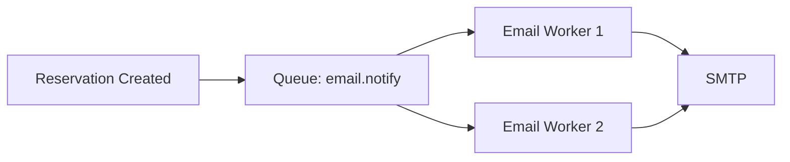

# Scalability

**Last updated:** 2026-07-04

## Scalability Strategy

TableFlow is designed for **horizontal scalability** of the stateless API layer, with a **vertically scalable** database as the initial approach, and future read replicas for read-heavy workloads.

---

## Current Architecture Limitations

| Limitation | Impact | Mitigation |
|------------|--------|------------|
| Single MySQL instance | Database becomes bottleneck at high throughput | Read replicas, connection pooling, query optimization |
| Monolithic deployment | All modules scale together | Module extraction to microservices (Phase 6+) |
| Synchronous email sending | Blocks request while sending email | Async queue for notifications |
| Single-process Node.js | Limited to single CPU core | Horizontal scaling via multiple instances behind load balancer |

---

## Horizontal Scaling (API Layer)

The API layer is **stateless** — any instance can handle any request.

```
                         ┌──────────────────┐
                         │   Load Balancer   │
                         │   (Round Robin)   │
                         └────────┬─────────┘
                                  │
            ┌─────────────────────┼─────────────────────┐
            │                     │                     │
            ▼                     ▼                     ▼
    ┌──────────────┐     ┌──────────────┐     ┌──────────────┐
    │ API Instance 1│     │ API Instance 2│     │ API Instance N│
    │  (stateless)  │     │  (stateless)  │     │  (stateless)  │
    └──────┬───────┘     └──────┬───────┘     └──────┬───────┘
           │                    │                    │
           └────────────────────┼────────────────────┘
                                │
                                ▼
                        ┌──────────────┐
                        │    MySQL     │
                        │  (Primary)   │
                        └──────────────┘
```

**Requirements for horizontal scaling:**
- Docker containers with no local state.
- JWT-based authentication (no session affinity needed).
- Database connection pooling (Prisma handles this).
- Health check endpoint for load balancer.

---

## Vertical Scaling (Database)

Initial approach: Scale up the MySQL instance.

| Resource | Initial | Scale Target |
|----------|---------|--------------|
| CPU | 4 cores | 16+ cores |
| RAM | 8 GB | 64 GB |
| Storage | 100 GB SSD | 1 TB SSD |
| Connections | 100 | 500+ |

---

## Database Read Replicas

When the database becomes read-bound, add read replicas:

```
                         ┌──────────────┐
                         │    MySQL     │
                         │  (Primary)   │
                         └──────┬───────┘
                                │
                ┌───────────────┼───────────────┐
                │               │               │
                ▼               ▼               ▼
        ┌──────────────┐ ┌──────────────┐ ┌──────────────┐
        │ Read Replica │ │ Read Replica │ │ Read Replica │
        │      1       │ │      2       │ │      3       │
        └──────────────┘ └──────────────┘ └──────────────┘
```

**Read/write split:**
- All writes go to primary.
- Read queries (reports, dashboard, customer search) go to replicas.
- Prisma supports read replicas natively via `@prisma/extension-read-replicas`.

---

## Caching Strategy

### Current Phase (No Cache)

All queries hit the database directly. Acceptable at low volume.

### Phase 1: In-Memory Cache

| Cache Target | Key | TTL | Benefit |
|-------------|-----|-----|---------|
| Role-permissions | `role:{roleId}:permissions` | 1 hour | Avoids DB lookup on every request |
| Branch configuration | `branch:{id}:config` | 5 minutes | Settings rarely change |
| Restaurant public info | `restaurant:{id}:public` | 10 minutes | Read-heavy, rarely changes |

### Phase 2: Redis Cache

When the application needs shared cache across instances:

| Cache Target | Type | TTL | Strategy |
|-------------|------|-----|----------|
| Role-permissions | Distributed | 1 hour | Cache-aside, invalidate on role change |
| Available time slots | Distributed | 30 seconds | Short TTL for real-time accuracy |
| Session blacklist | Distributed | 15 minutes | Token revocation list |
| Rate limiter | Distributed | Per window | Sliding window counter |

---

## Queue Support

### Current Phase (Synchronous)

- Email notifications are sent synchronously during the request.
- Acceptable at low volume (< 100 emails/hour).

### Future Phase (Async Queue)

When email volume grows or response time becomes critical:



**Queue options:** Bull (Redis-backed), RabbitMQ, or AWS SQS.

**Candidate tasks for async processing:**
- Email notifications.
- Report generation.
- Data export (CSV/PDF).
- Audit log bulk writes.
- Analytics aggregation.

---

## Performance Considerations

| Area | Strategy | Target |
|------|----------|--------|
| **Database queries** | N+1 detection via Prisma's `include` and `select`, indexed columns | All queries < 50ms |
| **API response time** | Caching, optimized queries, lazy loading | p95 < 200ms |
| **Frontend loading** | Code splitting, lazy routes, CDN assets | Lighthouse > 90 |
| **Bundle size** | Vite manual chunks, tree shaking | < 200 KB initial JS |
| **Image optimization** | CDN, lazy loading, responsive images | < 100 KB per image |

### Database Query Optimization Rules

```
✅ Use Prisma include/select to fetch only needed columns
✅ Use compound indexes for common query patterns
✅ Paginate every list endpoint
✅ Use batch operations for bulk inserts/updates

❌ Never SELECT *
❌ Never load related entities lazily in loops (N+1)
❌ Never sort unindexed columns on large tables
```

### Query Pattern Examples

```typescript
// Good: specific columns + relations
const reservation = await prisma.reservation.findUnique({
  where: { id },
  select: {
    id: true,
    date: true,
    time: true,
    partySize: true,
    status: true,
    customer: { select: { id: true, name: true, phone: true } },
    table: { select: { id: true, number: true } },
  },
});

// Bad: SELECT * + N+1
const reservations = await prisma.reservation.findMany();
for (const r of reservations) {
  const customer = await prisma.customer.findUnique({ where: { id: r.customerId } }); // N+1!
}
```

---

## Horizontal Scaling Limits

| Component | Limit | Mitigation |
|-----------|-------|------------|
| MySQL connections | Limited by `max_connections` | Connection pooling (Prisma), read replicas |
| Node.js event loop | CPU-bound tasks block | Offload CPU work to worker threads or queue |
| Docker container resources | Per-host limits | Orchestration (Kubernetes / ECS) |

---

## Future Microservices Extraction

The module boundaries make extraction straightforward. When extraction is needed:

1. Identify the module with the highest resource consumption.
2. Extract it as a separate service with its own API.
3. Communication between monolith and new service via REST or gRPC.
4. Monolith module becomes a proxy client to the new service.

**Most likely first extraction candidates:**
- **Notifications** — Email sending is I/O-bound and benefits from dedicated workers.
- **Reports** — Report generation is CPU-intensive and blocks the API.
- **Audit** — Audit log writes can be async without impacting core reservation flow.

---

## Related Documents

- [architecture-overview.md](./architecture-overview.md) — System architecture
- [architecture-style.md](./architecture-style.md) — Modular monolith rationale
- [future-evolution.md](./future-evolution.md) — Long-term evolution plan
