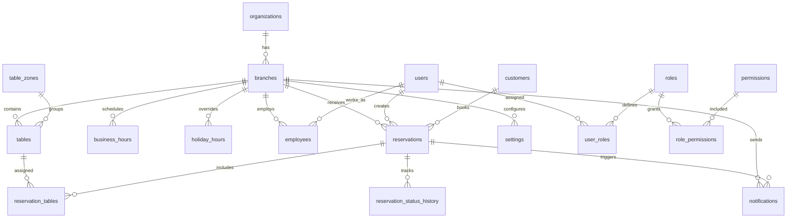

# Database Overview

**Last updated:** 2026-07-04

## Database Engine

| Attribute | Value |
|-----------|-------|
| **Engine** | MySQL 8.0+ |
| **Storage** | InnoDB |
| **Character Set** | `utf8mb4` |
| **Collation** | `utf8mb4_unicode_ci` |
| **ORM** | Prisma |
| **Management** | MySQL Workbench |

---

## High-Level Data Model

```
organizations 1────N branches
branches     1────N tables
branches     1────N business_hours
branches     1────N holiday_hours
branches     1────N employees
branches     1────N settings
branches     1────N reservations
branches     1────N notifications
users        1────N user_roles
roles        1────N user_roles
roles        N────M permissions (via role_permissions)
reservations N────1 customers
reservations N────M tables (via reservation_tables)
reservations N────1 users (created_by)
reservations 1────N reservation_status_history
customers    1────N reservations
users        1────N employees
employees    N────1 branches
```

---

## Entity Summary

| Entity | Type | Description |
|--------|------|-------------|
| `organizations` | Core | Parent tenant — a restaurant company |
| `branches` | Core | Physical restaurant location under an organization |
| `users` | Core | System users (staff, admins, support) |
| `roles` | Core | Named collections of permissions |
| `permissions` | Core | Discrete system actions |
| `role_permissions` | Associative | Many-to-many: role ↔ permission |
| `user_roles` | Associative | Many-to-many: user ↔ role with branch scope |
| `employees` | Core | Staff working at a specific branch |
| `customers` | Core | Diner profiles |
| `tables` | Core | Physical restaurant tables |
| `table_zones` | Core | Table grouping zones (patio, indoor, VIP) |
| `reservations` | Core | Booking records — central entity |
| `reservation_tables` | Associative | Many-to-many: reservation ↔ table |
| `reservation_status_history` | Audit | Status change trail |
| `business_hours` | Core | Operating hours per day of week |
| `holiday_hours` | Core | Override hours for special dates |
| `notifications` | Log | Notification delivery records |
| `notification_templates` | Core | Email/SMS template configurations |
| `audit_logs` | Audit | Immutable system event log |
| `refresh_tokens` | Security | JWT refresh token storage |
| `settings` | Config | Key-value configuration store |
| `payments` | Future | Payment records |
| `payment_methods` | Future | Payment method definitions |

---

## Database Design Principles

| Principle | Application |
|-----------|-------------|
| **Normalization** | 3NF for all tables. See [normalization.md](./normalization.md). |
| **ACID compliance** | InnoDB engine. Transactions for multi-table operations (reservation creation). |
| **Referential integrity** | Foreign keys enforced at database level. |
| **Auditability** | Every table has `created_at`, `updated_at`. Critical tables also have `updated_by` (FK → users). Soft-deleted tables have `deleted_at`. |
| **UUID primary keys** | All tables use UUID v7 for distributed-friendly, non-sequential, sortable keys. |
| **Index-first design** | Indexes defined at design time for expected query patterns. See [indexes.md](./indexes.md). |
| **Soft delete** | Business entities use soft delete. See [soft-delete-strategy.md](./soft-delete-strategy.md). |

---

## ER Diagram (High Level)



---

## Database Sizing Estimates

| Table | Est. Records (Year 1) | Est. Records (Year 3) | Growth Rate |
|-------|----------------------|----------------------|-------------|
| organizations | 100 | 500 | Low |
| branches | 200 | 1,200 | Medium |
| users | 500 | 3,000 | Medium |
| customers | 50,000 | 500,000 | High |
| tables | 4,000 | 24,000 | Medium |
| reservations | 500,000 | 5,000,000 | High |
| reservation_tables | 600,000 | 6,000,000 | High |
| reservation_status_history | 1,500,000 | 15,000,000 | High |
| audit_logs | 1,000,000 | 10,000,000 | High |
| notifications | 1,000,000 | 10,000,000 | High |
| refresh_tokens | 10,000 | 60,000 | Medium |

---

## Related Documents

- [entity-analysis.md](./entity-analysis.md) — Detailed entity definitions
- [table-design.md](./table-design.md) — Complete table specifications
- [relationships.md](./relationships.md) — Relationship details
- [normalization.md](./normalization.md) — Normalization analysis
