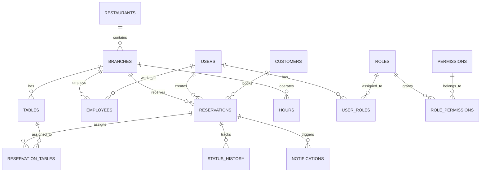
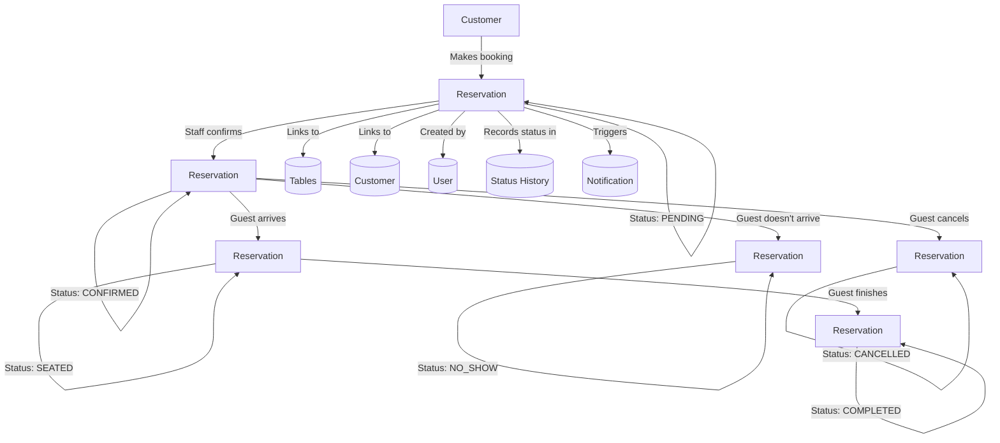

# Entity Relationship Diagram

**Last updated:** 2026-07-04

## Complete ER Diagram

```mermaid
erDiagram
    organizations {
        uuid id PK
        string name
        string email
        string phone
        text address
        string logo_url
        string timezone
        datetime created_at
        datetime updated_at
        datetime deleted_at
    }

    branches {
        uuid id PK
        uuid organization_id FK
        string name
        string address
        string phone
        string email
        string timezone
        string cuisine_type
        int average_dining_duration
        int max_advance_booking_days
        int slot_interval
        int max_party_size
        boolean is_online_reservation_enabled
        datetime created_at
        datetime updated_at
        datetime deleted_at
    }

    users {
        uuid id PK
        string email UK
        string password_hash
        string first_name
        string last_name
        string phone
        boolean is_active
        boolean is_verified
        int failed_login_attempts
        datetime locked_until
        datetime last_login_at
        datetime created_at
        datetime updated_at
        datetime deleted_at
    }

    roles {
        uuid id PK
        string name UK
        string description
        boolean is_system
        datetime created_at
        datetime updated_at
    }

    permissions {
        uuid id PK
        string name UK
        string description
        string module
        string risk_level
        datetime created_at
    }

    role_permissions {
        uuid role_id FK
        uuid permission_id FK
    }

    user_roles {
        uuid user_id FK
        uuid role_id FK
        uuid branch_id FK "nullable"
    }

    employees {
        uuid id PK
        uuid user_id FK
        uuid branch_id FK
        string employee_code UK
        string position
        date hired_at
        datetime created_at
        datetime updated_at
        datetime deleted_at
    }

    customers {
        uuid id PK
        string email UK
        string phone UK
        string first_name
        string last_name
        int total_visits
        int total_cancellations
        int total_noshows
        boolean is_flagged
        text notes
        json preferences
        datetime created_at
        datetime updated_at
        datetime deleted_at
    }

    table_zones {
        uuid id PK
        uuid branch_id FK
        string name
        string description
        int sort_order
        datetime created_at
        datetime updated_at
    }

    tables {
        uuid id PK
        uuid branch_id FK
        uuid zone_id FK "nullable"
        string table_number
        int capacity
        int max_capacity
        boolean is_active
        int position_x
        int position_y
        string shape
        int width
        int height
        datetime created_at
        datetime updated_at
        datetime deleted_at
    }

    reservations {
        uuid id PK
        uuid branch_id FK
        uuid customer_id FK
        uuid created_by FK
        uuid assigned_to FK "nullable"
        string confirmation_code UK
        date date
        time time
        int party_size
        enum status
        string cancellation_reason
        text special_requests
        text internal_notes
        boolean is_walk_in
        enum source
        datetime checked_in_at
        datetime checked_out_at
        datetime cancelled_at
        datetime no_show_marked_at
        datetime created_at
        datetime updated_at
    }

    reservation_tables {
        uuid reservation_id FK
        uuid table_id FK
        datetime assigned_at
    }

    reservation_status_history {
        uuid id PK
        uuid reservation_id FK
        enum from_status
        enum to_status
        uuid changed_by FK
        string reason
        datetime created_at
    }

    business_hours {
        uuid id PK
        uuid branch_id FK
        int day_of_week
        time open_time
        time close_time
        boolean is_closed
        datetime created_at
        datetime updated_at
    }

    holiday_hours {
        uuid id PK
        uuid branch_id FK
        date date
        time open_time
        time close_time
        boolean is_closed
        string description
        datetime created_at
        datetime updated_at
    }

    notifications {
        uuid id PK
        uuid branch_id FK
        uuid reservation_id FK "nullable"
        enum type
        string recipient_email
        string recipient_phone
        enum status
        datetime sent_at
        text error_message
        datetime created_at
    }

    notification_templates {
        uuid id PK
        uuid branch_id FK "nullable"
        enum type
        string subject
        text body
        datetime created_at
        datetime updated_at
    }

    audit_logs {
        uuid id PK
        uuid user_id FK "nullable"
        string action
        string resource_type
        string resource_id
        json details
        string ip_address
        string user_agent
        datetime created_at
    }

    refresh_tokens {
        uuid id PK
        uuid user_id FK
        string token_hash
        datetime expires_at
        boolean is_revoked
        datetime created_at
    }

    settings {
        uuid id PK
        uuid branch_id FK "nullable"
        string key
        json value
        datetime created_at
        datetime updated_at
    }
```

---

## Relationship Summary

| Relationship | Type | Description |
|-------------|------|-------------|
| organization → branches | 1:N | One organization has many branches |
| branch → tables | 1:N | One branch has many tables |
| branch → employees | 1:N | One branch employs many staff |
| branch → reservations | 1:N | One branch receives many reservations |
| branch → business_hours | 1:N | One branch has 7 business hour records |
| branch → holiday_hours | 1:N | One branch can have many holiday overrides |
| branch → notifications | 1:N | One branch sends many notifications |
| branch → settings | 1:N | One branch has many settings |
| user → employees | 1:N | One user can be an employee at multiple branches |
| user → reservations (created) | 1:N | One user creates many reservations |
| user → user_roles | 1:N | One user can have many role assignments |
| role → user_roles | 1:N | One role can be assigned to many users |
| role → role_permissions | 1:N | One role includes many permissions |
| permission → role_permissions | 1:N | One permission belongs to many roles |
| customer → reservations | 1:N | One customer can make many reservations |
| table → reservation_tables | 1:N | One table can be in many reservation assignments |
| reservation → reservation_tables | 1:N | One reservation can include many tables |
| reservation → reservation_status_history | 1:N | One reservation has many status changes |
| reservation → notifications | 1:N | One reservation triggers many notifications |
| table_zone → tables | 1:N | One zone groups many tables |

---

## Module Relationship Diagram

---

## Reservation Flow Diagram

---

## Related Documents

- [table-design.md](./table-design.md) — Detailed column definitions
- [relationships.md](./relationships.md) — Relationship analysis
- [constraints.md](./constraints.md) — Integrity constraints
