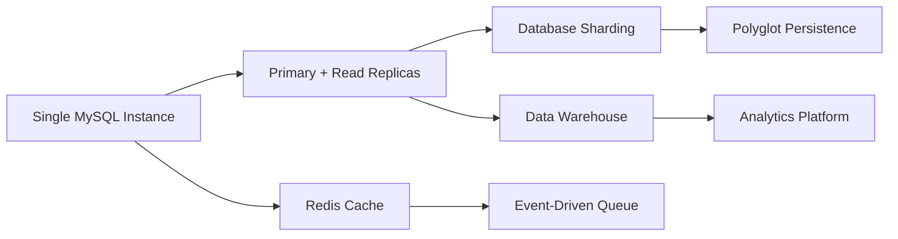

# Future Scalability

**Last updated:** 2026-07-04

## Scalability Evolution Path



---

## Phase 1: Single Instance (Initial Launch)

**Capacity:** 500K reservations/year, 200 branches, 50K customers

| Component | Configuration |
|-----------|---------------|
| MySQL | 4 vCPU, 16 GB RAM, 100 GB SSD |
| Connections | 200 max |
| Backup | Daily mysqldump + binary logs |

**Limitation:** Database becomes bottleneck above ~2M reservations/year.

---

## Phase 2: Read Replicas (Year 2)

**When:** Read queries (reports, dashboard, customer search) start impacting write performance.

**Architecture:**

```
                         ┌──────────────────┐
                         │   Application    │
                         └────────┬─────────┘
                                  │
                    ┌─────────────┼─────────────┐
                    │             │             │
                    ▼             ▼             ▼
            ┌────────────┐ ┌────────────┐ ┌────────────┐
            │   Primary  │ │  Replica 1 │ │  Replica 2 │
            │   (Write)  │ │  (Read)    │ │  (Read)    │
            └────────────┘ └────────────┘ └────────────┘
```

**Implementation:**
- Prisma read replica extension routes SELECT queries to replicas.
- All writes (INSERT, UPDATE, DELETE) go to the primary.
- Replicas asynchronously replicate from the primary.

**Tables benefiting from read replicas:**
- `reservations` — dashboard loads, report generation
- `customers` — search queries
- `audit_logs` — compliance queries

---

## Phase 3: Redis Cache Layer

**When:** Application response times degrade due to frequent database queries.

**Caching architecture:**

```pseudo
Application → Cache (Redis) → Database
              Hit: return cached
              Miss: query DB, populate cache, return
```

**Cache targets (in priority order):**

| Data | Key Pattern | TTL | Rationale |
|------|-------------|-----|-----------|
| Available time slots | `branch:{id}:slots:{date}:{party}` | 30s | Highest frequency query |
| Role-permissions | `role:{id}:permissions` | 1h | Validated on every request |
| Active reservations | `branch:{id}:active` | 10s | Dashboard real-time feel |
| Business hours | `branch:{id}:hours` | 1h | Rarely changes |

---

## Phase 4: Database Sharding

**When:** Single database cannot handle write volume (> 5M reservations/year).

**Sharding key:** `organization_id`

**Architecture:**

```
                   ┌──────────────────┐
                   │   Query Router   │
                   └────────┬─────────┘
          ┌─────────────────┼─────────────────┐
          │                 │                 │
          ▼                 ▼                 ▼
  ┌──────────────┐ ┌──────────────┐ ┌──────────────┐
  │  Shard 1     │ │  Shard 2     │ │  Shard 3     │
  │  Org 1-33    │ │  Org 34-66   │ │  Org 67-100  │
  └──────────────┘ └──────────────┘ └──────────────┘
```

**Implementation complexity:** High. Requires application-level routing or a proxy like ProxySQL. Each shard has its own read replicas.

**Tables that share the sharding key:** All tables with `organization_id` or `branch_id` cascade.

**Tables that are global (not sharded):** `roles`, `permissions` (system-level, rarely updated).

---

## Phase 5: Analytics Data Warehouse

**When:** Reporting queries on 10M+ rows impact production database performance.

**Architecture:**

```
Production MySQL → ETL Pipeline → Analytics Warehouse
                                      │
                                      ▼
                              BI Tools (Metabase, Grafana)
```

**ETL approach:**
- Incremental nightly sync of reservation, customer, and notification data.
- Denormalized star schema for analytics.
- Historical data aggregated by day, week, month.

**Analytics-specific tables:**
- `fact_reservations` — One row per reservation with dimension IDs
- `dim_customers` — Customer dimension (slowly changing)
- `dim_branches` — Branch dimension
- `dim_date` — Date dimension for time-based analysis

---

## Phase 6: Archival Strategy

**When:** `reservations` exceeds 10M rows, `audit_logs` exceeds 20M rows.

**Archival rules:**

| Table | Archive Age | Archive Method | Queryable |
|-------|-------------|----------------|-----------|
| reservations | > 12 months | Move to archive database | Yes (archive DB) |
| audit_logs | > 12 months | Export to S3/Glacier | No (requires restore) |
| notifications | > 6 months | Keep only last 6 months in production | No |
| reservation_status_history | > 12 months | Move with reservations | Yes (archive DB) |

**Implementation:**
- Monthly archival job during maintenance window.
- Production database retains only recent data.
- Archived data remains queryable via a separate reporting interface.

---

## Phase 7: Polyglot Persistence

**When:** Different data types need different storage engines.

| Data Type | Recommended Store | Reason |
|-----------|-------------------|--------|
| Reservation transactions | MySQL (relational) | ACID, complex queries |
| Customer activity feed | Redis / MongoDB | High write volume, simple reads |
| Full-text search | Elasticsearch | Advanced customer search |
| Analytics aggregates | ClickHouse / Druid | Columnar storage for aggregations |
| File uploads (images) | S3 / GCS | Object storage |

---

## Performance Budget

| Metric | Phase 1 (Year 1) | Phase 2 (Year 2) | Phase 3 (Year 3+) |
|--------|-----------------|-----------------|-------------------|
| Active branches | 200 | 600 | 1,200 |
| Reservations/month | 40K | 170K | 420K |
| API response time (p95) | < 200ms | < 200ms | < 200ms |
| Dashboard load (p95) | < 500ms | < 500ms | < 500ms |
| Database connections | 200 | 400 | 800+ |

---

## Related Documents

- [scalability.md](../architecture/scalability.md) — Application scalability
- [performance.md](./performance.md) — Database performance optimization
- [backup-strategy.md](./backup-strategy.md) — Backup at scale
